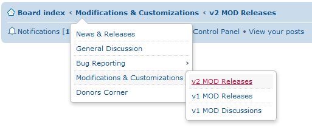

Breadcrumb Menu for phpBB 3.1
==========

Extension for phpBB 3.1 to turn the breadcrumb navigation into a forum tree menu.

## Features
- Adds a drop-down menu to each breadcrumb, containing the sibling and child forums.
- Triggers on mouse-enter, no clicks required (this keeps the breadcrumbs working as normal when clicking on them).
- Auto-hide when the user moves the cursor outside of the menu. 

#### Requirements
- >= phpBB 3.1-dev
- >= PHP 5.4

#### Languages supported
- No language files included/necessary

#### To do list
- Replace the PHP branch selector, using eval() is not ideal.
- Have the dropdown menu selector operate based on actual IDs instead of simply counting.
- Make everything responsive.
- Include the main tree in the board index crumb (perhaps as a fly-out to the right).
- Check to see that it doesn't break when other extensions try to prepend/append stuff to the breadcrumbs.
- Perhaps make an ACP module so admins can set certain vars (such as animations and timers).

## Installation
You can install this on the latest copy of the develop branch (phpBB 3.1-dev) by following the steps below.

**Manual:**

1. If there is not yet an `./ext/paybas/breadcrumbmenu/` folder tree starting from your board root, create one.
2. Copy the entire contents of this repo into that folder you just created (You can leave out the *.md files, screenshot.png, .gitignore, and the .git folder).
3. Go to `ACP -> Customise -> Manage extensions -> Extensions`
4. Click Enable.

**Git:**

1. From the board root run the following git command:
`git clone https://github.com/paybas/BreadcrumbMenu.git ext/paybas/breadcrumbmenu`
2. Go to `ACP -> Customise -> Manage extensions -> Extensions`
3. Click Enable.

## Uninstallation
In the ACP -> Customise -> Manage Extensions -> Extensions module, you can click one of the following:
- **Disable:** This keeps the Extension data and schema intact but prevents it from running. The whole thing kinda falls apart. The administration area will be unavailable. When you re-enable the extension, all functionality will become active again.
- **Delete data:** This destroys any data added by the extension, and reverts any schema changes it made. You can re-enable the extension, but all the settings of this extension will be gone.

### License
[GNU General Public License v2](http://opensource.org/licenses/GPL-2.0)

© 2014 - PayBas